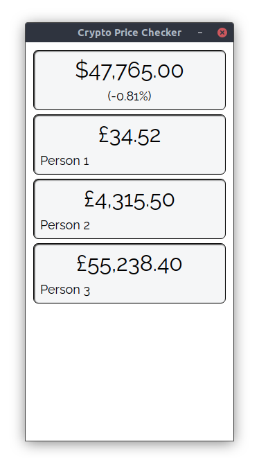

# Crypto Price Checker
A small tool which acts as a Bitcoin ticker, but also tells you how much your bitcoin wallets are worth in £.

## Why?
I want to know how well my wallets are doing relative to the current price of Bitcoin, but I don't want to have an Electrum window open for each one. Also I want to learn more about Electron, and web development in general.

## Usage instructions
Open config.json and add your "accounts". Each account consists of a name that is shown on the screen and an amount of Bitcoin. If you're nervous, simply edit the example values.

Once you're happy with your "accounts", run the application. You can do this by opening a terminal and running "npm start".

## Concerns and considerations
This application cannot steal your Bitcoin. It never interacts with your keys or seed phrase, you simply tell it how much you want to track and it takes your word for it.

This application never tells the Internet how much Bitcoin you have. Since one Bitcoin can be split into 100 million pieces, an exact value could make it easier to find your specific wallet. The Crypto Price Checker works by querying the price of one Bitcoin, and doing the maths on the user's computer.

## Extra features
Config.json contains some extra options to play with. resizeable lets you enable the ability to resize the window, making it more friendly for people with tiling window managers. devmode enables the top bar, for easier access to Electron's dev tools.

Palette lets you adjust the colours used by the application. They let you adjust the colour of the background, "cards" and text respectively. Use this to theme the application to better fit your desktop, if you want.

## Features I'd like to implement
- More cryptocurrencies
- A way to add wallets without editing a text file

## Credits
This application uses Electron.js. It uses the Raleway font, which can be found here: https://github.com/impallari/Raleway/
